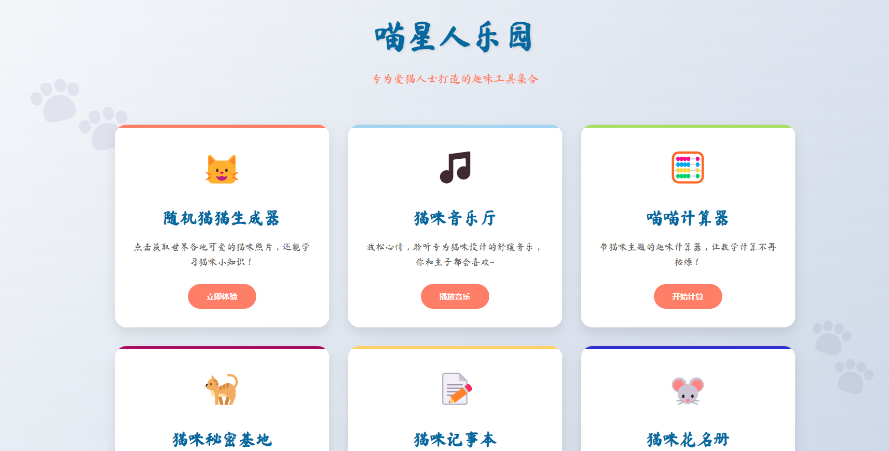
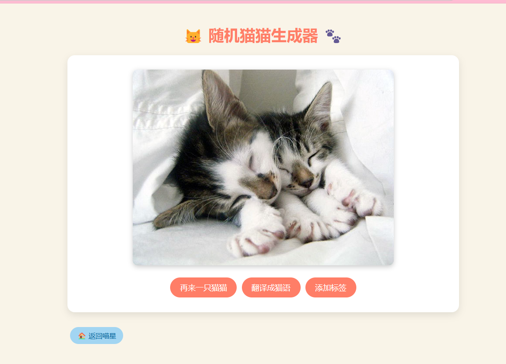

# 喵喵猫舍管理系统 (Grand Cat)

## 项目介绍
喵喵猫系统是一个基于Vue 3和Spring Boot的全栈应用，主要为了展示一些基础技能。

## 预览




## 技术栈

### 前端
- Vue 3
- Vue Router
- Vite
- Marked (Markdown解析)

### 后端
- Spring Boot 3.1.0
- Spring Data JPA
- MySQL 8

## 快速开始

```bash
# 克隆仓库
git clone https://github.com/yourusername/grand_cat.git
cd grand_cat

```

启动后可访问:
- 前端: http://localhost:80
- 后端API: http://localhost:8080

### 开发环境设置

#### 前端
```bash
cd cat2
npm install
npm run dev
```

#### 后端
```bash
cd cat2_back
./gradlew bootRun
```

## 主要功能
- 随机猫猫图片获取
- 猫猫数据登记
- 展示three.js

## 贡献指南
欢迎提交Issues和Pull Requests!